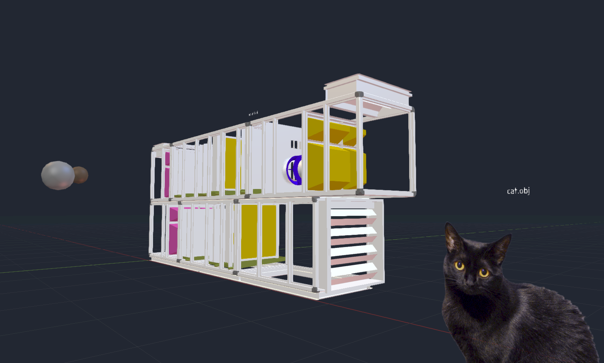

# VoxView

VoxView is a 3D engine/viewer package for Lazarus written in FreePascal. Its standout feature is full support for accurate order-independent transparency, an essential for CAD visualization, for which it was specifically designed.

**General features:**
- Fully customizable shader-based rendering pipeline w/ support for textures, framebuffers etc.
- Constant-framerate draw scheduling with time-parameterized OnFrame event for animations
- Mesh creation/manipulation utilities (i.e. create sphere, revolve line strip around axis, fill polygon from points, create texture-mapped label from text
- Object dependency system aka parent-child relations
- 3D object import/export (currently .obj only)
- Plug-and-play (Lazarus): Drag component onto form, create/import models and you're ready to go

**Standard renderer features:**
- Blinn-Phong shading w/ materials, sun and point lamps
- Full fragment-level order-independent transparency using dual depth peeling

**CAD-specific features:**
- Full 3D navigation move set (orbit, zoom, dolly, pan)
- Built-in background grid
- Orthographic projection w/ view macros (frontal view, isometric view, fit visible to screen)
- Point-and-click object selection
- Visual object outlining

**Additional features:**
- Ability to load TrueType (.ttf) fonts from resources via just the resource name (unit ResourceTTF)
- Legacy OpenGL fixed-function pipeline hooking, enabling conversion from glVertex3f et al. into VoxView mesh objects (unit VoxViewFFGL) (basic features)
